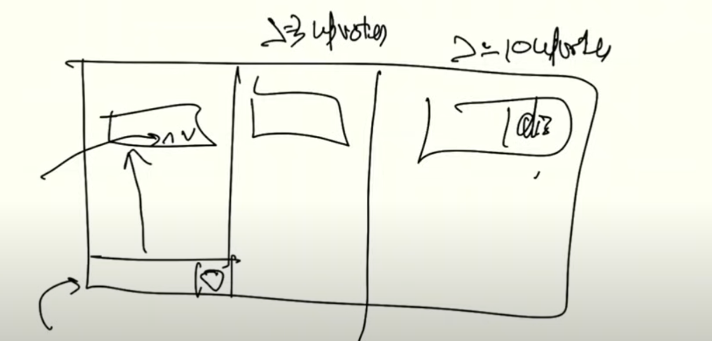

## VC APP : 

## Rate Limiting : for slowing down the commenting Rate

## Uproting : Bring Quizes, post msgs, upvote msgs etc

## Most upvoted comments, etc 

## WORKING : 
1) If more than 10,000 people are going to come in a chat/vc => create a Distributed web socket server
2) If <10000 people + Rate Limiting => Simple web socket server

## ADDING WEB SOCET LIBRARIES : 
1) npm's websocket library : npm i websocket
-> for real time communication : bare min usecase : chatting, vc, etc. 
-> can be done via https : using long polling (wrong way)
-> Best way to use Web Sockets

